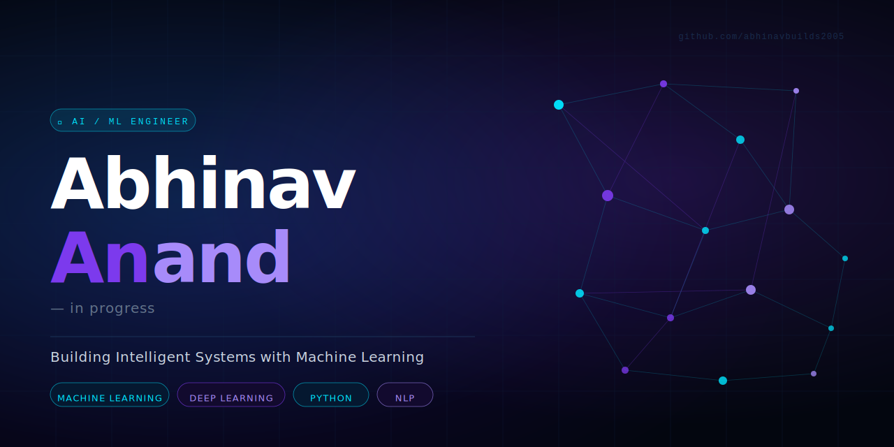
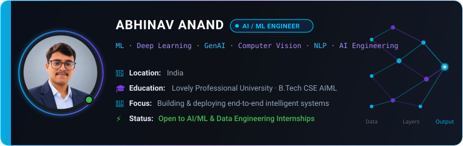
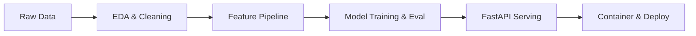

<div align="center">

<!--  -->

<br/><br/>

<a href="https://linkedin.com/in/abhinav-anand-865926300">
  
</a>

# Hi, I'm Abhinav Anand 👋
### AI/ML Engineer in Progress · Building Intelligent Systems

<p align="center">
  <em>I build machine learning and AI applications that move from data and experimentation to usable software.</em>
</p>

<p align="center">
  
</p>

<p align="center">
  <a href="https://coderabhinavanand.netlify.app/"></a>
  <a href="https://linkedin.com/in/abhinav-anand-865926300"></a>
  <a href="mailto:abhinavanand9996@gmail.com"></a>
  <a href="https://github.com/abhinavbuilds2005"></a>
</p>

<p align="center">
  
</p>

</div>

---

## 📌 Snapshot & Positioning

> **"I don't just learn AI concepts. I build and deploy AI systems."**

I am an undergraduate in **Computer Science & Engineering with specialization in AI & Machine Learning (2025–2029)** at **Lovely Professional University**. My work bridges the gap between data exploration, model training, and production software engineering. Rather than stopping at notebook prototypes, I design end-to-end architectures—from data preprocessing and algorithmic verification to containerized REST APIs and responsive interfaces.

---

## 🔬 What I Build

| Domain | Focus Areas & Technical Scope |
| :--- | :--- |
| **Machine Learning** | Supervised & unsupervised learning, classification, regression, clustering, feature engineering pipelines |
| **Deep Learning** | Neural network architectures, CNNs, representation learning, biometric embedding spaces |
| **Generative AI** | LLM orchestration, Retrieval-Augmented Generation (RAG), chunked vector embeddings, semantic search |
| **Computer Vision** | OCR pipelines, forensic document tamper detection, facial feature extraction, biometric verification |
| **AI Engineering** | Production APIs with FastAPI, model serving, Docker containerization, cloud deployment workflows |

---

## 🚀 Featured AI Systems

### 🔐 [DocuShield AI](https://github.com/abhinavbuilds2005/DocuShield)
**AI-Based Multimodal Identity & Forensic Document Screening System**  
*Computer vision + OCR + multimodal evidence fusion system for forensic verification of identity documents.*

* **Built with:** `FastAPI` · `React 18` · `EasyOCR` · `OpenCV` · `Docker` · `Python`
* **What it does:**
  * Ingests and classifies identity documents across 5 core categories: Passports, Visas, National IDs, Driving Licences, and Travel Permits.
  * Detects digital tampering and image manipulation through Error Level Analysis (ELA), Copy-Move detection using ORB feature matching with RANSAC, and Laplacian blur/quality variance.
  * Validates algorithmic check digits, including ICAO Doc 9303 Machine Readable Zone (MRZ) 7-3-1 weighted modulus checks and India Aadhaar 12-digit Verhoeff checksums (D5 dihedral group).
* **Engineering highlights:**
  * **Multimodal Evidence Fusion Engine:** Hierarchical fusion across text, image forensics, and identity integrity with calibrated risk scores and transparent evidence items for human inspectors.
  * **Engineered Test Suite:** 179 automated tests validating API endpoints, payload boundaries, path-traversal safeguards, and decompression security.
  * **Scoped Forensic Benchmark:** Evaluated on a 20-document dataset (10 authentic, 10 manipulated) achieving 100% benchmark classification accuracy on the test set.
* **Links:** [💻 Repository](https://github.com/abhinavbuilds2005/DocuShield)

---

### 📄 [ATS Resume Analyzer](https://github.com/abhinavbuilds2005/ATS-RESUME-ANALYZER)
**AI-Powered Heuristic Resume Scorer & Semantic Gap Engine**  
*End-to-end career intelligence tool that parses resumes, scores formatting and technical relevance against target job descriptions, and provides actionable optimization insights.*

* **Built with:** `FastAPI` · `spaCy` · `Sentence Transformers` · `Groq (Llama 3.1)` · `Supabase` · `WeasyPrint`
* **What it does:**
  * Securely extracts and tokenizes text from PDF and genuine DOCX files with boundary protections.
  * Evaluates resumes across multi-dimensional criteria: formatting structure (20%), keyword matching (25%), content impact (25%), skill validation (15%), and privacy compliance (15%).
  * Cross-references declared candidate skills against claimed work experience descriptions to flag unsubstantiated skill claims.
* **Engineering highlights:**
  * **Chunk-Based Semantic Similarity:** Employs rolling chunked embeddings via `all-MiniLM-L6-v2` to prevent 5,000-character truncation loss during semantic comparison against job descriptions.
  * **Resilient Graceful Fallback:** Automatically falls back to deterministic rule-based NLP extraction if the external LLM API is unavailable, ensuring zero service disruption.
  * **Candidate Privacy Protection:** Uses Supabase JWT authentication to isolate user history and flags excessive PII (full street addresses, postal codes) while preserving city/state entries.
* **Links:** [💻 Repository](https://github.com/abhinavbuilds2005/ATS-RESUME-ANALYZER)

---

### 🏦 [CreditWise](https://github.com/abhinavbuilds2005/credit-wise-loan-system)
**End-to-End Loan Approval & Risk Scoring System**  
*Machine learning risk scoring application designed for transparent, interpretable credit default prediction.*

* **Built with:** `Python` · `Scikit-learn` · `Logistic Regression` · `SHAP` · `Streamlit`
* **What it does:**
  * Automates loan applicant intake, executes custom feature engineering (debt-to-income ratios and credit score variances), and estimates default risk in real time.
  * Replaces opaque yes/no verdicts with granular model confidence scores and interpretable risk factors.
* **Engineering highlights:**
  * **Explainable AI:** Integrated SHAP (SHapley Additive exPlanations) to surface individual risk drivers directly in the UI, enabling transparent financial decision support.
  * **Production Pipeline:** End-to-end preprocessing pipeline encapsulating scaling, categorical encoding, and inference within an interactive web dashboard.
* **Links:** [🌐 Live Application](https://credishield-one.vercel.app) · [💻 Repository](https://github.com/abhinavbuilds2005/credit-wise-loan-system)

---

### 🎓 [PresentAI — Biometric Attendance Platform](https://github.com/abhinavbuilds2005/AI-Powered-Attendance-Platform)
**Multimodal Biometric Attendance & Identification System**  
*Low-latency classroom attendance system integrating real-time facial recognition and acoustic voice verification.*

* **Built with:** `FastAPI` · `Python` · `dlib` · `SVM` · `Resemblyzer` · `Supabase` · `WebCam/Audio APIs`
* **What it does:**
  * Allows students to self-enroll via QR codes and log in using passwordless biometric FaceID.
  * Enables instructors to capture classroom snapshots or audio to automatically mark attendance for multiple students simultaneously.
* **Engineering highlights:**
  * **Dual Biometric Modalities:** 128-dimensional facial embedding vectors with Euclidean distance verification paired with speaker utterance matching via acoustic voice prints.
  * **Analytics & Export:** Aggregated attendance timelines and instant one-click CSV report exports backed by Supabase PostgreSQL.
* **Links:** [💻 Repository](https://github.com/abhinavbuilds2005/AI-Powered-Attendance-Platform)

---

### 🛒 [SmartCart](https://github.com/abhinavbuilds2005/Smartcart-Recommendation-system)
**Customer Intelligence Platform & Predictive Churn Segmentation**  
*Unsupervised machine learning platform for behavioral customer segmentation and targeted retention strategy.*

* **Built with:** `Python` · `Scikit-learn` · `K-Means Clustering` · `PCA` · `Streamlit`
* **What it does:**
  * Segments e-commerce customer purchase patterns to identify high-value customer clusters and early indicators of churn risk.
* **Engineering highlights:**
  * **Visual Dimensionality Reduction:** Implemented PCA (Principal Component Analysis) with explained variance ratios surfaced directly in the UI for interactive cluster exploration.
  * **Segment-Level Churn Analytics:** Pairs unsupervised K-Means clusters with churn probability metrics to generate automated, actionable retention recommendations.
* **Links:** [💻 Repository](https://github.com/abhinavbuilds2005/Smartcart-Recommendation-system)

---

## ⚙️ How I Build AI Systems

I treat machine learning as an engineering discipline. Models are only as good as the data, validation, and serving infrastructure supporting them:



> **Engineering Philosophy:**  
> *"I learn by building — grounding theoretical concepts in working software, then strengthening the system through rigorous testing, error analysis, and iterative refinement."*

---

## 🧠 Generative AI & Representations

Rather than treating LLMs as standalone wrappers, I apply Generative AI concepts to solve structural data and semantic challenges:

* **Retrieval-Augmented Generation (RAG):** Applied in **ATS Resume Analyzer** with Sentence Transformers (`all-MiniLM-L6-v2`) and rolling chunking windows to compare resumes against multi-paragraph job specifications without context truncation.
* **Resilient LLM Pipelines:** Architecting dual-mode systems using Groq Llama 3.1 for deep synthesis, paired with deterministic rule-based NLP fallbacks so the application never fails on API throttling or network failure.
* **Vector Embeddings & Manifolds:** Extracting dense representation spaces—from linguistic embeddings for resume skill extraction to 128-d biometric manifolds in **PresentAI**.

---

## 🛠️ Tech Stack

```
Languages    : Python · C++ · SQL · JavaScript
ML & DL      : PyTorch · Scikit-learn · NumPy · Pandas · OpenCV
GenAI & NLP  : spaCy · Sentence Transformers · Hugging Face · Groq · LangChain
Backend & DB : FastAPI · Supabase (PostgreSQL) · Docker · Streamlit · REST APIs
Tools & Env  : Git · GitHub · Linux / Bash · VS Code · Jupyter Notebook
```

<p align="center">
  
  
  
  
  
  
  
  
</p>

---

## 🔥 Currently Building

* 🤖 **AI Engineering:** Designing containerized, microservice-based inference backends with FastAPI and structured validation.
* 🧠 **Computer Vision & Forensics:** Extending multimodal image tampering detection and biometric authentication workflows.
* ✨ **Generative AI & Retrieval:** Deepening knowledge of advanced RAG patterns, embedding rerankers, and autonomous agent loops.
* 💻 **Data Structures & Algorithms:** Practicing core algorithmic problem solving and optimization in C++.

---

## 📜 Certifications

| Certification | Platform / Authority | Verification |
| :--- | :--- | :--- |
| **SQL (Advanced)** | HackerRank | Verified |
| **Introduction to Artificial Intelligence** | Infosys Springboard | Verified |
| **Machine Learning Foundations** | Course Certificate | Verified |

---

## 📊 Selected GitHub Activity

<div align="center">

<p align="center">
  
  
</p>

<picture>
  <source media="(prefers-color-scheme: dark)" srcset="https://raw.githubusercontent.com/abhinavbuilds2005/abhinavbuilds2005/output/github-snake-dark.svg" />
  <source media="(prefers-color-scheme: light)" srcset="https://raw.githubusercontent.com/abhinavbuilds2005/abhinavbuilds2005/output/github-snake.svg" />
  
</picture>

</div>

---

## 🤝 Let's Build Something Intelligent

I am actively seeking opportunities where I can apply my machine learning, deep learning, and AI engineering skills to real-world engineering challenges.

**Open to:**
* 🎯 AI / Machine Learning Engineering Internships
* 🔬 Applied Machine Learning & Computer Vision Roles
* 🤝 Technical Collaborations & Open-Source AI Systems

<p align="center">
  <a href="https://coderabhinavanand.netlify.app/"></a>
  <a href="https://linkedin.com/in/abhinav-anand-865926300"></a>
  <a href="mailto:abhinavanand9996@gmail.com"></a>
  <a href="https://github.com/abhinavbuilds2005"></a>
</p>

<p align="center">
  <em>Building one intelligent system at a time.</em>
</p>
